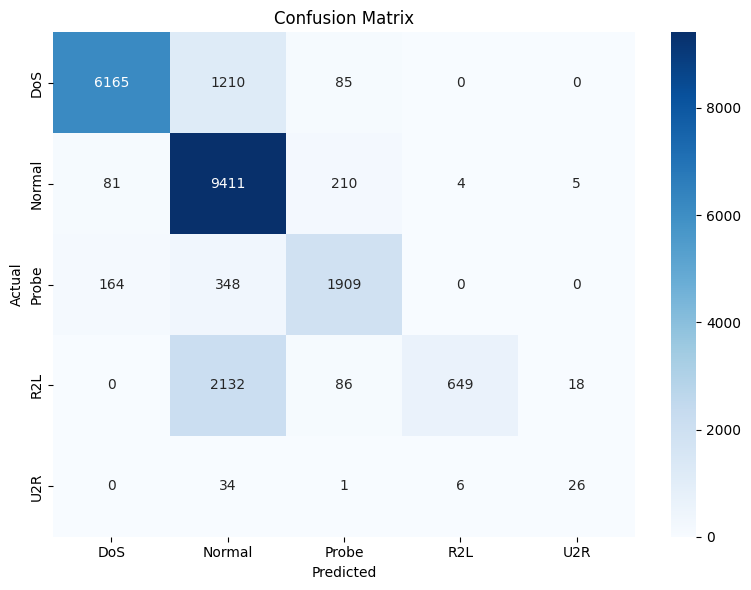

Network intrusion detection report
Course: Advanced Python for Cybersecurity
Team members: Virgo Teos
Date: 25.05.2026

1.	Approach
1.1	Strategy Overview
I didn’t have a specific strategy before starting with the assignment. The idea was to experiment with different parameters to see which of them have a noticeable impact on the F1 scores. At the end I would try to implement all of the parameters with a considerable impact together.

1.2	Preprocessing
Feature engineering: I did not create any new features.
Feature selection: I did not remove any existing features.
Scaling: No scaling was applied because the tree-based models i worked with (XGBoost, LightGBM) required no feature scaling.

1.3	Class Imbalance Handling
Methods used: Balanced class weights, manual class weights, SMOTE, Random Undersampling
Parameters: Balanced class weights: class_weight=’balanced’. Manual class weights: DoS = 1, Normal = 1, Probe = 2, R2L = 10, U2R = 25.
Effect on training set distribution: Balanced class weights and manual class weights did not change the number of samples in the dataset. R2L and U2R classes had larger importance weights than majority classes. Mistakes made on rare classes were penalized more heavily. SMOTE increased the number of R2L and U2R samples by generating synthetic samples. Random Undersampling reduced the number of majority class examples, by randomly removing them. It created a more balanced dataset, however some important information may have been removed from the training data.

2.	Experiments

Total number of experiments: 23
Experiments NOT related to changing model parameters: 7

A majority of the experiments that were run were related to changing different model parameters. The different ranges for each parameter tested: n = 110-300, max_depth = 3-5, learning_rate = 0.05-0.1

The following experiments are not related to changing model parameters. The parameters used for all of these experiments are n_estimators = 150, max_depth = 4, learning_rate = 0.1.

Experiment 1: Baseline XGBoost
Algorithm: XGBoost
What changed from baseline: This is the baseline experiment.
Baseline parameters: n_estimators = 150, max_depth = 4, learning_rate = 0.1
Macro F1 (CV): 0.9506
Macro F1 (test): 0.5754
Observation: XGBoost expectedly preformed well with majority classes, but struggled with R2L and U2R.

Experiment 2: Balanced class weights
Algorithm: XGBoost
What changed from baseline: Added balanced class weights.
Macro F1 (CV): 0.9263
Macro F1 (test): 0.6336
Observation:  Balanced class weighting noticeably improved macro F1 compared to the baseline. Rare class mistakes were penalized more heavily, due to which the model became more sensitive towards them.

Experiment 3: Manual class weights
Algorithm: XGBoost
What changed from baseline: Added manual class weights. DoS = 1, Normal = 1, Probe = 2, R2L = 10, U2R = 25
Macro F1 (CV): 0.9263
Macro F1 (test): 0.5990
Observation: The manual class weights set did not improve performance as much compared to balanced weights. Increasing the penalties too much caused the model to focus too much on minority classes, without significantly improving the score.

Experiment 4: Applied SMOTE
Algorithm: XGBoost
What changed from baseline: Added SMOTE
Macro F1 (CV): 0.9043
Macro F1 (test): 0.6675
Observation: Produced the best overall performance. By generating synthetic examples for the minority classes, the model learned their respective attack patterns more effectively and increased R2L and U2R recall.

Experiment 5: SMOTE and Random Undersampling
Algorithm: XGBoost
What changed from baseline: Added SMOTE and Random Undersampling
Macro F1 (CV): 0.9506
Macro F1 (test): 0.5689
Observation: Combining SMOTE and Random Undersampling significantly reduced test macro F1 score. Randomly removing majority class examples caused the model to lose valuable information about those classes.

Experiment 6: SMOTE and Balanced class weights
Algorithm: XGBoost
What changed from baseline: Added SMOTE and balanced class weights
Macro F1 (CV): 0.9263
Macro F1 (test): 0.6675
Observation: Balanced weights and SMOTE used together produced almost identical results to only SMOTE. This suggests, that SMOTE already compensated for the imbalance in the data set, making additional weighing unnecessary.

Experiment 7: Used LightGBM
Algorithm: LightGBM
What changed from baseline: Using LightGBM instead of XGBoost
Macro F1 (CV): 0.7859
Macro F1 (test): 0.5375
Observation: Macro F1 score noticeably lower than XGBoost. Struggled more with R2L and U2R class detection and overall performed worse on the test set.

Experiments Summary
#	Description	Algorithm	Imbalance handling	Macro F1 CV	Macro F1 Test
1	Baseline	XGBoost	None	0.9506	0.5754
2	Balanced class weights	XGBoost	Balanced weights	0.9263	0.6336
3	Manual class weights	XGBoost	Manual weights	0.9263	0.5990
4	Applied SMOTE	XGBoost	SMOTE	0.9043	0.6675
5	SMOTE and Random Undersampling	XGBoost	SMOTE + Random Undersampling	0.9506	0.5689
6	SMOTE and Balanced class weights	XGBoost	SMOTE + Balanced weights	0.9263	0.6675
7	Used LightGBM	LightGBM	None	0.7859	0.5375

3.	Final Results
3.1	Best Model
Algorithm: XGBoost
Key parameters: n_estimators = 150, max_depth = 4, learning_rate = 0.1
Imbalance handling: SMOTE oversampling
Feature engineering: None

3.2	Final Macro F1 Scores
Metric	Score
Macro F1 test	0.6675
Macro F1 CV	0.9043

3.3	Classification Report
Category	Precision	Recall	F1 Score	Support
Normal	0.7165	0.9691	0.8239	9711
DoS	0.9618	0.8264	0.8890	7460
Probe	0.8333	0.7885	0.8103	2421
R2L	0.9848	0.2250	0.3663	2885
U2R	0.5306	0.3881	0.4483	67

3.4	Confusion Matrix

4.	Cross-Validation vs. Test Score

CV Macro F1: 0.9043
Test macro F1: 0.6675
Gap: 0.2368
Analysis: CV score is significantly higher than the final test macro f1 score. It’s expected due to the KDDTest+ dataset containing attack types that are not present in the training set. The model did well with known attack patterns, but struggled with the previously unseen variants. The final score is mainly dragged down due to the R2L and U2R class. The gap could also hint at overfitting, however, attempts at resolving it resulted in a lower test F1 score.

5.	What worked and What didn’t

What had the biggest positive impact? 
The biggest positive impact was made by the addition of SMOTE oversampling. It mainly improved R2L and U2R recall, which contributed to the jump in F1 scores. (0.5754 -> 0.6675)

What surprisingly didnt help?
Balanced class weighting had very little effect once SMOTE was applied. Combining undersampling with SMOTE also reduced performance significantly, because too much majority class information was removed.

What would you try with more time?
With more time I would:
•	Experiment with non tree-based algorithms
•	Experiment with ensemble methods (voting classifier)
•	Try feature engineering
•	Experiment with removing existing features
•	Experiment with scaling (other algorithms)

Appendix: Environment
Hardware: Google Colab Environment
Python version: Python 3.x
Key libraries: pandas, numpy, scikit-learn, xgboost, imbalanced-learn, seaborn, matplotlib
Random seed: 339
